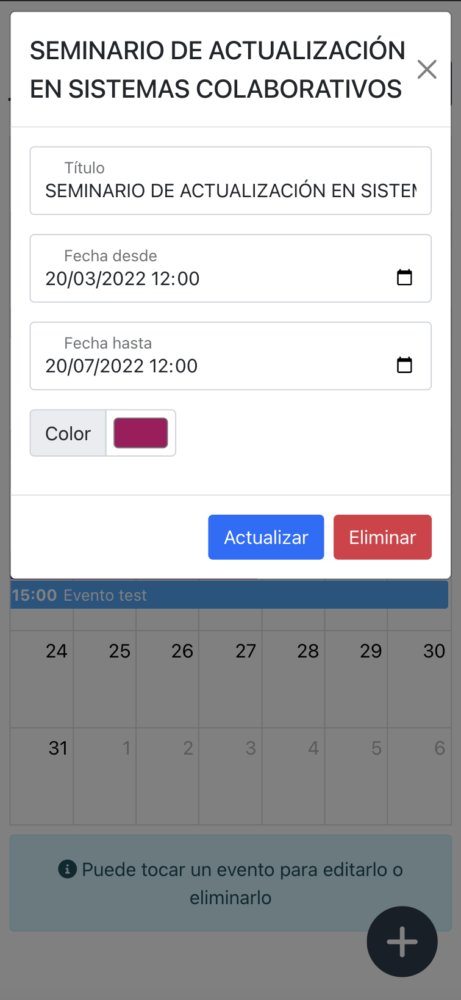

# calendar-app

App desarrollada con ReactJS consumiendo la API calendar-app desarrollada en Golang utilizando el framework Gin gonic.

App de ejercicio para la materia Sistemas Colaborativos de la Universidad Siglo 21

## App Screenshots

